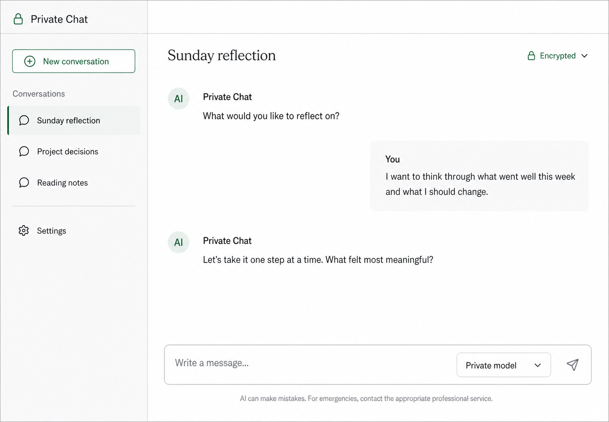
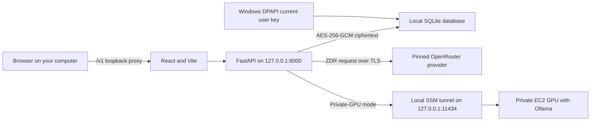
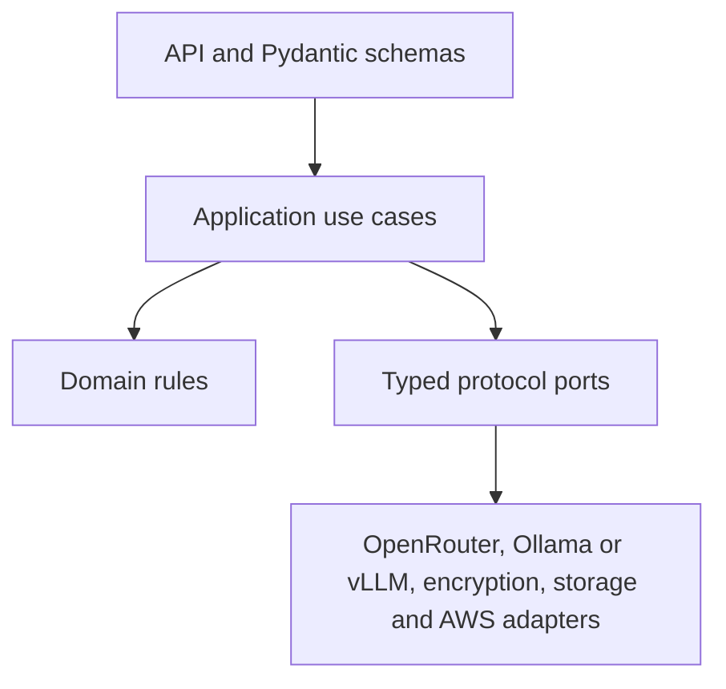

# Private Chat on AWS

Private Chat is a loopback-only personal chatbot with application-encrypted conversation storage and replaceable model backends. Its normal mode stores encrypted transcripts in a local SQLite database and uses privacy-restricted OpenRouter inference. The AWS GPU path remains optional infrastructure that can be rebuilt with Terraform when needed.

This repository implements the engineering foundation from the [project brief](Private-AWS-Chatbot-Project-Brief.docx). It is designed for personal, loopback-only use. It is not a public multi-user deployment: authentication and authorisation would be required before exposing the API beyond the computer running it.



## What is included

- A Python 3.12 FastAPI backend with Pydantic v2 validation.
- Ports-and-adapters boundaries for model inference, encrypted persistence, key management and GPU lifecycle control.
- An OpenRouter adapter that always supplies ZDR, denies provider data collection, disables fallbacks and requires an allowlist.
- A private self-hosted adapter for Ollama or vLLM-compatible endpoints.
- AES-256-GCM envelope-encryption primitives and safe in-memory development adapters.
- A React and TypeScript chat interface connected to the typed FastAPI conversation API.
- Terraform for private networking, KMS, encrypted conversation storage and an optional default-off GPU host.
- An opt-in EC2 Image Builder pipeline that produces a tested, private Ollama GPU AMI from pinned and checksum-verified inputs.
- An opt-in private S3 model landing bucket and script for staging a pinned, checksum-verified Hugging Face GGUF.
- A personal-use SSM tunnel and shell workflow that starts and stops the private GPU without public management ports.
- Provider-wide AWS cost tags for project, environment, owner, cost centre and repository reporting.
- Automated unit, contract, lint, type, build and Terraform checks.
- Architecture decisions, a threat model and operational runbooks.

## Choose a session mode

| Mode | Where inference runs | What you pay for while using it | When to use it |
|---|---|---|---|
| Private GPU | Ollama on the private AWS GPU, reached through an SSM tunnel | GPU compute and temporary SSM interface endpoints | You want prompts and inference to stay in your AWS environment. |
| Local OpenRouter (default) | A pinned ZDR OpenRouter provider over HTTPS | OpenRouter usage only; no AWS resources | You want normal hosted-model use with encrypted local storage. |

Both modes use the same React interface and FastAPI API. The model selector is persisted per conversation and displays only backend-approved models; switches are recorded in the encrypted timeline and apply to subsequent responses. An OpenRouter API key never reaches the browser. OpenRouter is privacy-restricted hosted inference, not end-to-end private inference: the approved provider receives the prompt to generate its response.

The hosted adapter sends only the model request and required routing controls. It deliberately does not attach OpenRouter's optional user, session, referral, title, trace or arbitrary metadata fields. This separates an OpenRouter account from the downstream provider, but does not make text that identifies its author anonymous.

For a private GPU session, follow the [personal session runbook](ops/runbooks/personal-session.md). For OpenRouter-only mode, use the dedicated section in the same runbook.

## Architecture



The browser never connects directly to the GPU or to OpenRouter. In private-GPU mode, the SSM tunnel makes Ollama appear locally at `127.0.0.1:11434`; FastAPI then talks to that loopback address. The GPU can be stopped between sessions without affecting stored conversations.

The backend uses explicit dependency inversion:



See [the architecture guide](docs/architecture.md) and [architecture decisions](docs/adr) for the reasoning behind these boundaries.

## Repository layout

```text
backend/        FastAPI service, domain logic, adapters and tests
frontend/       React/Vite interface and component tests
terraform/      AWS infrastructure with an optional private GPU host
docs/           Architecture, ADRs, design reference and threat model
ops/            Operational runbooks
.github/        Continuous-integration checks
```

## Local development

### Requirements

- Python 3.12
- Node.js 20 or later
- pnpm 11
- Terraform 1.8 or later for infrastructure validation

### Backend

```powershell
cd backend
python -m venv .venv
.\.venv\Scripts\Activate.ps1
python -m pip install -e ".[dev]"
Copy-Item .env.example .env
```

Copy the local configuration, set a real OpenRouter API key, then start the full local app:

```powershell
..\scripts\start-chat-app.ps1
```

For backend-only work, use:

```powershell
..\scripts\start-local-chat.ps1
```

The development API listens on `http://127.0.0.1:8000`.

### Frontend

```powershell
cd frontend
pnpm install --frozen-lockfile
pnpm dev
```

The interface calls the local FastAPI backend through Vite's same-origin `/v1`
proxy. Follow the [personal session runbook](ops/runbooks/personal-session.md) to
connect that backend to Ollama on the private GPU.

Assistant responses support safe Markdown rendering for headings, lists, links and code blocks. Raw HTML is not rendered. Responses currently arrive once the model has completed generation; the interface shows a generation-in-progress message rather than streaming individual tokens.

### Terraform

Terraform defaults to no GPU instance. Read [the infrastructure guide](terraform/README.md), provide reviewed regional inputs, and inspect the complete plan before applying anything:

```powershell
cd terraform
Copy-Item terraform.tfvars.example terraform.tfvars
terraform init
terraform plan -out tfplan
```

Do not apply this example to an AWS account until its IAM, state backend, authentication path and cost controls have been reviewed for that account.

To stage a model for the GPU image, use the [model staging
runbook](ops/runbooks/stage-model.md). It explains the one-time storage setup and
the script that securely downloads, verifies and uploads an immutable GGUF.

Terraform requires `owner` and `cost_center` values and applies protected cost-allocation
tags to supported AWS resources automatically. After deployment, activate those tag keys
in AWS Billing and Cost Management before expecting them in Cost Explorer.

## Quality checks

```powershell
cd backend
ruff check .
mypy src
pytest

cd ../frontend
pnpm lint
pnpm test
pnpm build

cd ../terraform
terraform fmt -check -recursive .
terraform init -backend=false
terraform validate
```

Continuous integration runs the corresponding checks for pull requests and changes to the main branch.

## Security model

- The encrypted local transcript is authoritative. Summaries and memories are derived, versioned data with provenance.
- Plaintext is present briefly in application RAM and model memory during inference; application-level encryption cannot protect active processing.
- Prompt and response bodies must never enter application, API Gateway, tracing or infrastructure logs.
- The browser must never receive OpenRouter or AWS credentials.
- OpenRouter policy is enforced inside its adapter so route handlers cannot accidentally omit ZDR, provider pinning, data-collection denial or disabled fallbacks.
- The optional GPU is private compute. It receives no public IP, and its model port accepts traffic only from the application security group.
- Local encryption and repository adapters are development implementations. Production requires AWS KMS and durable encrypted storage adapters.

Read [SECURITY.md](SECURITY.md) and [the threat model](threat-model.md) before using real conversation data.

## Engineering principles

- Validate at boundaries with Pydantic and strict TypeScript.
- Encapsulate workflows in application services rather than routes or UI components.
- Depend on typed interfaces; select concrete infrastructure in a composition root.
- Keep security controls fail-closed and covered by regression tests.
- Prefer useful docstrings and decision comments over comments that repeat syntax.
- Keep changes small, typed, tested and reviewable.

See [CONTRIBUTING.md](CONTRIBUTING.md) for the working agreement.

## Current limitations

- Personal mode relies on loopback-only FastAPI binding and local AWS identity; it is not a public authentication mechanism.
- AWS Terraform and S3/KMS adapters are retained as optional infrastructure. Normal local operation does not contact AWS; an old local Terraform state must be refreshed before a future apply.
- The GPU AMI factory and runtime session flow are implemented, but model choice and licence acceptance, trusted artefact checksums, GPU quotas and regional availability remain deployment-specific decisions.
- Responses are not token-streamed. Long local generations display an in-progress state and have a bounded backend timeout.
- GPU temperature, utilisation and VRAM usage are available through administrative commands such as `nvidia-smi`, not through the browser settings panel.
- The local frontend uses the FastAPI conversation API; authentication is still required before exposing that API beyond the user's computer.
- This application is not a substitute for professional, medical, legal, financial or emergency support.
