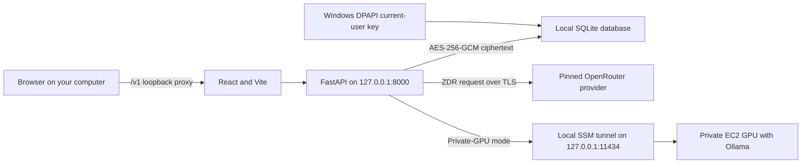
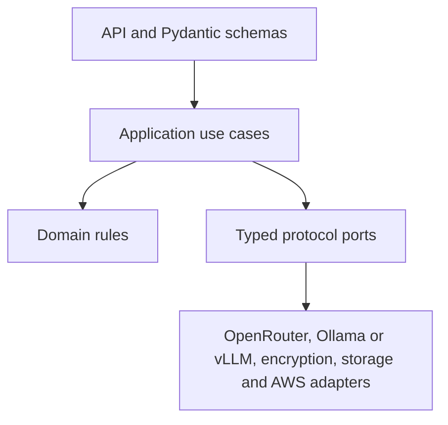

# Private Chat

Private Chat is a loopback-only personal chatbot with application-encrypted conversation storage and replaceable model backends. Its normal mode stores encrypted transcripts in a local SQLite database and uses privacy-restricted OpenRouter inference. The AWS GPU path remains optional infrastructure that can be rebuilt with Terraform when needed.

This repository implements the engineering foundation from the [project brief](Private-AWS-Chatbot-Project-Brief.docx). It is designed for personal, loopback-only use. It is not a public multi-user deployment: authentication and authorisation would be required before exposing the API beyond the computer running it.


## What is included

- A Python 3.12 FastAPI backend with Pydantic v2 validation.
- Ports-and-adapters boundaries for model inference, the approved model catalogue, private conversation instructions, encrypted persistence, key management and GPU lifecycle control.
- An OpenRouter adapter that always supplies ZDR, denies provider data collection, disables fallbacks and requires an allowlist.
- A private self-hosted adapter for Ollama or vLLM-compatible endpoints.
- AES-256-GCM envelope encryption for message content and user-managed conversation titles.
- A React and TypeScript chat interface with editable conversation names, connected to the typed FastAPI conversation API.
- Conversation-level model selection for new and active chats, with encrypted model-change timeline events.
- Per-assistant-message model, token and provider-reported cost information that remains attached to the response that generated it.
- Terraform for private networking, KMS, encrypted conversation storage and an optional default-off GPU host.
- An opt-in EC2 Image Builder pipeline that produces a tested, private Ollama GPU AMI from pinned and checksum-verified inputs.
- An opt-in private S3 model landing bucket and script for staging a pinned, checksum-verified Hugging Face GGUF.
- A personal-use SSM tunnel and shell workflow that starts and stops the private GPU without public management ports.
- Provider-wide AWS cost tags for project, environment, owner, cost centre and repository reporting.
- Automated unit, contract, lint, type, build and Terraform checks.
- Architecture decisions, a threat model and operational runbooks.

## Choose a session mode

| Mode | Where inference runs | What you pay for while using it | When to use it |
|---|---|---|---|
| Private GPU | Ollama on the private AWS GPU, reached through an SSM tunnel | GPU compute and temporary SSM interface endpoints | You want prompts and inference to stay in your AWS environment. |
| Local OpenRouter (default) | A pinned ZDR OpenRouter provider over HTTPS | OpenRouter usage only; no AWS resources | You want normal hosted-model use with encrypted local storage. |

Both modes use the same React interface and FastAPI API. The model selector is persisted per conversation and displays only backend-approved models; switches are recorded in the encrypted timeline and apply to subsequent responses. An OpenRouter API key never reaches the browser. OpenRouter is privacy-restricted hosted inference, not end-to-end private inference: the approved provider receives the prompt to generate its response.

The hosted adapter sends only the model request and required routing controls. It deliberately does not attach OpenRouter's optional user, session, referral, title, trace or arbitrary metadata fields. This separates an OpenRouter account from the downstream provider, but does not make text that identifies its author anonymous.

For a private GPU session, follow the [personal session runbook](ops/runbooks/personal-session.md). For OpenRouter-only mode, use the dedicated section in the same runbook.

## Model selection and message provenance

The model selector is available before creating a conversation, in the active
conversation header and in Settings. A mid-conversation change takes effect on
the next response and retains the eligible conversation history. The backend
validates every selection against its server-controlled catalogue; restricting
the browser selector alone is not treated as a security control.

Each assistant response retains the exact model ID, display name, provider,
token usage and available cost information reported for that generation.
Changing the active model later does not relabel historical responses. Model
change events are stored in the encrypted timeline but are excluded from model
context and token accounting.

Gemini 3.7 Flash is the default for a new conversation. The approved catalogue
is grouped below; startup ZDR validation fails closed if a configured model no
longer has its approved route.

| Family | Display name | OpenRouter model ID |
|---|---|---|
| Google | Gemini 3.7 Flash | `google/gemini-3.7-flash` |
| Mistral | Ministral 3B | `mistralai/ministral-3b-2512` |
| Mistral | Ministral 14B | `mistralai/ministral-14b-2512` |
| Mistral | Mistral Small 3 | `mistralai/mistral-small-2603` |
| Mistral | Mistral Medium 3.5 | `mistralai/mistral-medium-3-5` |
| Mistral | Mistral Large | `mistralai/mistral-large-2512` |
| OpenAI | GPT-5.6 Luna | `openai/gpt-5.6-luna` |
| OpenAI | GPT-5.6 Terra | `openai/gpt-5.6-terra` |
| OpenAI | GPT-5.6 Sol | `openai/gpt-5.6-sol` |
| DeepSeek | DeepSeek V4 Flash | `deepseek/deepseek-v4-flash` |
| DeepSeek | DeepSeek V4 Pro | `deepseek/deepseek-v4-pro` |
| Qwen | Qwen 3.8 27B | `qwen/qwen3.8-27b` |
| Qwen | Qwen 3.8 2.4T A95B | `qwen/qwen3.8-2.4t-a95b` |
| Anthropic | Claude Sonnet 5 | `anthropic/claude-sonnet-5` |
| Anthropic | Claude Opus 5 | `anthropic/claude-opus-5` |

The canonical IDs and their pinned downstream routes live in
[`backend/src/private_chat/config.py`](backend/src/private_chat/config.py).

## Private conversation instructions

Optional private instructions are loaded from the ignored local file
`.local/conversation-instructions.md` by default. They are injected as a system
message for inference, but are never stored as a conversation message, returned
through the API or intentionally written to logs. The local instructions created
for this installation are supportive and reflection-oriented while avoiding
diagnosis, clinical claims, dependency-building or presenting the application
as a therapist.

To use a different ignored file, set `CHAT_INSTRUCTIONS_FILE` in
`backend/.env`. If the configured file is absent or empty, the backend continues
without it and emits a non-sensitive warning. Keep both the instruction body and
`backend/.env` out of Git; `.local/` and local environment files are ignored.

## Architecture



The browser never connects directly to the GPU or to OpenRouter. In private-GPU mode, the SSM tunnel makes Ollama appear locally at `127.0.0.1:11434`; FastAPI then talks to that loopback address. The GPU can be stopped between sessions without affecting stored conversations.

The backend uses explicit dependency inversion:



See [the architecture guide](docs/architecture.md) and [architecture decisions](docs/adr) for the reasoning behind these boundaries.

## Repository layout

```text
backend/        FastAPI service, domain logic, adapters and tests
frontend/       React/Vite interface and component tests
scripts/        One-command local launcher and operational helpers
terraform/      AWS infrastructure with an optional private GPU host
docs/           Architecture, ADRs, design reference and threat model
ops/            Operational runbooks
.github/        Continuous-integration checks
```

## Local development

### Requirements

- Python 3.12 or later
- Node.js 20.19 or later
- pnpm 11
- Terraform 1.8 or later for infrastructure validation

### First-time local setup

Run these commands once from the repository root:

```powershell
cd backend
python -m venv .venv
.\.venv\Scripts\Activate.ps1
python -m pip install -e ".[dev]"
Copy-Item .env.example .env
cd ..\frontend
pnpm install --frozen-lockfile
cd ..
```

Open `backend/.env` and replace
`REPLACE_WITH_YOUR_OPENROUTER_API_KEY` with a real OpenRouter API key. The file
is ignored by Git but contains a spend-capable plaintext credential, so do not
share, commit or screenshot it.

The virtual environment does not need to be activated when using the combined
launcher; it selects `backend/.venv/Scripts/python.exe` automatically.

### Start the programme

For normal use, open PowerShell in the repository root and run this single
command:

```powershell
.\scripts\start-chat-app.ps1
```

It starts the FastAPI backend and React frontend as hidden loopback-only
processes, waits for both to become ready and opens the interface at
<http://127.0.0.1:5173>. It reuses either process if its expected port is already
listening, writes startup logs under the ignored `.local/runtime-logs` folder
and does not start or contact AWS infrastructure.

If PowerShell blocks local scripts, allow this script only for the current
PowerShell process and run it again:

```powershell
Set-ExecutionPolicy -Scope Process Bypass
.\scripts\start-chat-app.ps1
```

The backend health endpoint is <http://127.0.0.1:8000/v1/health>. For
backend-only development, run `scripts/start-local-chat.ps1` instead.

### Start the services separately for development

The combined launcher is the normal workflow. When actively developing one
side, the services can still be run separately:

```powershell
cd backend
.\.venv\Scripts\Activate.ps1
python -m uvicorn private_chat.main:app --reload --host 127.0.0.1 --port 8000

# In a second PowerShell window:
cd frontend
pnpm run dev -- --host 127.0.0.1 --port 5173
```

The interface calls the local FastAPI backend through Vite's same-origin `/v1`
proxy. Follow the [personal session runbook](ops/runbooks/personal-session.md) to
connect that backend to Ollama on the private GPU.

Assistant responses support safe Markdown rendering for headings, lists, links and code blocks. Raw HTML is not rendered. Responses currently arrive once the model has completed generation; the interface shows a generation-in-progress message rather than streaming individual tokens.

### Terraform

Terraform defaults to no GPU instance. Read [the infrastructure guide](terraform/README.md), provide reviewed regional inputs, and inspect the complete plan before applying anything:

```powershell
cd terraform
Copy-Item terraform.tfvars.example terraform.tfvars
terraform init
terraform plan -out tfplan
```

Do not apply this example to an AWS account until its IAM, state backend, authentication path and cost controls have been reviewed for that account.

To stage a model for the GPU image, use the [model staging
runbook](ops/runbooks/stage-model.md). It explains the one-time storage setup and
the script that securely downloads, verifies and uploads an immutable GGUF.

Terraform requires `owner` and `cost_center` values and applies protected cost-allocation
tags to supported AWS resources automatically. After deployment, activate those tag keys
in AWS Billing and Cost Management before expecting them in Cost Explorer.

## Quality checks

```powershell
cd backend
ruff check .
mypy src
pytest

cd ../frontend
pnpm lint
pnpm test
pnpm build

cd ../terraform
terraform fmt -check -recursive .
terraform init -backend=false
terraform validate
```

Continuous integration runs the corresponding checks for pull requests and changes to the main branch.

## Security model

- The encrypted local transcript is authoritative. Summaries and memories are derived, versioned data with provenance.
- Plaintext is present briefly in application RAM and model memory during inference; application-level encryption cannot protect active processing.
- Prompt and response bodies must never enter application, API Gateway, tracing or infrastructure logs.
- The browser must never receive OpenRouter or AWS credentials.
- OpenRouter policy is enforced inside its adapter so route handlers cannot accidentally omit ZDR, provider pinning, data-collection denial or disabled fallbacks.
- OpenRouter can associate requests with the account and billing relationship. Downstream providers receive no intentionally forwarded personal account identifier, but identifiable text inside a prompt can still identify its author.
- Private conversation instructions remain local configuration; they are not part of persisted or API-visible conversation history.
- The optional GPU is private compute. It receives no public IP, and its model port accepts traffic only from the application security group.
- Local encryption and repository adapters are development implementations. Production requires AWS KMS and durable encrypted storage adapters.

Read [SECURITY.md](SECURITY.md) and [the threat model](threat-model.md) before using real conversation data.

## Engineering principles

- Validate at boundaries with Pydantic and strict TypeScript.
- Encapsulate workflows in application services rather than routes or UI components.
- Depend on typed interfaces; select concrete infrastructure in a composition root.
- Keep security controls fail-closed and covered by regression tests.
- Prefer useful docstrings and decision comments over comments that repeat syntax.
- Keep changes small, typed, tested and reviewable.

See [CONTRIBUTING.md](CONTRIBUTING.md) for the working agreement.

## Current limitations

- Personal mode relies on loopback-only FastAPI binding and local AWS identity; it is not a public authentication mechanism.
- AWS Terraform and S3/KMS adapters are retained as optional infrastructure. Normal local operation does not contact AWS; an old local Terraform state must be refreshed before a future apply.
- The GPU AMI factory and runtime session flow are implemented, but model choice and licence acceptance, trusted artefact checksums, GPU quotas and regional availability remain deployment-specific decisions.
- Responses are not token-streamed. Long local generations display an in-progress state and have a bounded backend timeout.
- GPU temperature, utilisation and VRAM usage are available in the local System Monitor;
  `nvidia-smi` remains useful for independent command-line diagnosis.
- The local **System Monitor** records privacy-safe performance telemetry only while the
  backend runs. It never records prompts, responses, transcript IDs or titles. Run
  `./scripts/setup-local-ollama.ps1` to install/verify Ollama and pull the supported
  `gemma3:4b` laptop model, then set `CHAT_ENABLE_LOCAL_OLLAMA=true` in `backend/.env`.
- The local frontend uses the FastAPI conversation API; authentication is still required before exposing that API beyond the user's computer.
- This application is not a substitute for professional, medical, legal, financial or emergency support.
