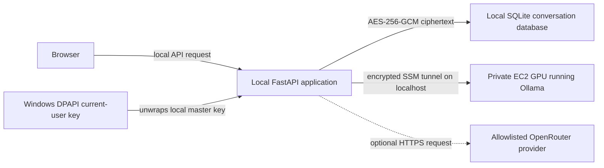

# Security architecture

This is a personal learning project, not a public multi-user service. It
processes private conversation content, so any deployment should be treated as
security-sensitive. The design keeps storage encryption, key management and
model inference separate so that changing a model provider does not silently
change how transcripts are protected.

## What this architecture protects

The primary goal is to prevent a copied storage object, lost disk or overly
broad storage read permission from exposing a readable conversation transcript.
It also reduces the network exposure of the self-hosted model and keeps
provider credentials out of the browser.

It does **not** make plaintext impossible to access while a request is being
served. The local FastAPI process decrypts relevant history to assemble a model
request, and the selected model necessarily receives that plaintext in its
process memory. A compromised laptop, authorised application runtime or running
inference host is therefore in scope as a residual risk, not something
encryption at rest can solve.

## Data flow and trust boundaries

In the intended personal session flow, React and FastAPI run on the user's
computer. The browser calls the local API; it never receives AWS or model
provider credentials. The FastAPI application reaches the self-hosted model
through an SSM port-forwarding tunnel that exposes the model only as
`127.0.0.1:11434` on the local computer.

The private GPU has no public IP, public SSH listener or public model-serving
port. Within the VPC, its model port accepts traffic only from the application
security group. It has no Internet gateway or NAT route; access to AWS services
is deliberately limited to VPC endpoints. Systems Manager provides the
administrative shell and tunnel without opening an inbound management port.

The default OpenRouter path is privacy-restricted hosted inference, not private
inference: an approved upstream provider receives the plaintext needed to
generate a response. The adapter pins every model to one reviewed provider,
requires ZDR and data-collection denial, and disables provider fallbacks.

## Conversation encryption

Conversation bodies are encrypted by the application before they are persisted.
The production AWS flow is envelope encryption:

1. The application asks the configured customer-managed KMS key to generate a
   new 256-bit data key for one message.
2. It encrypts the message locally with AES-256-GCM and a new random 96-bit
   nonce.
3. It binds the ciphertext to the conversation ID and message ID as authenticated
   additional data. A copied ciphertext cannot be swapped into another message
   record and still decrypt successfully.
4. The plaintext data key is discarded. The persisted record contains only the
   ciphertext, nonce, KMS-wrapped data key, KMS key ID and algorithm identifier.
5. To read a message, the application asks KMS to unwrap that message's data key
   with the same authenticated context, then verifies and decrypts the
   AES-GCM payload locally.

S3 then adds a second storage-layer control: each conversation object is written
with SSE-KMS using the same customer-managed KMS key. S3 bucket policy rejects
non-TLS requests, public access is blocked, versioning is enabled, and uploads
that omit or select another KMS key are denied. Application encryption remains
the primary transcript control; S3 encryption is defence in depth, not a
replacement for it.

Only message bodies are encrypted. Conversation IDs, generic titles, message
roles and timestamps remain in the S3 document so the application can find and
order records. Titles deliberately default to `New conversation` rather than
copying potentially sensitive text into plaintext object metadata.

The default Windows mode stores ciphertext in local SQLite. A random 32-byte
master key is protected with Windows DPAPI in current-user scope and is used to
wrap the random per-message data keys. The database therefore contains no
plaintext messages or plaintext master key. The default path is
`%LOCALAPPDATA%\PrivateLLMChat`; it is not synced or backed up by this project.

This protects a copied database or offline disk, particularly when BitLocker is
enabled, but it does not protect malware or another process already running as
the same Windows user. Such a process can ask DPAPI to unlock the same key the
application needs. There is deliberately no recovery export: a Windows reinstall
or lost Windows profile makes the encrypted transcripts unrecoverable.

## Keys, credentials and access

KMS is used for cryptographic key operations, not as a general secret store.
It protects the project key and authorises `GenerateDataKey`, `Decrypt` and
related operations. KMS activity can be audited through CloudTrail, which must
be enabled and reviewed in the target AWS account. The application data policy
grants only the S3 conversation prefix and the specific KMS key permissions
needed for encrypted transcript operations.

AWS Secrets Manager is not provisioned by this repository. It would be the
appropriate service for a stored credential that needs versioning and automatic
rotation, such as a database password. The default OpenRouter API key is supplied
through ignored local `.env` configuration and is plaintext on disk. It must never be committed,
placed in Terraform variables, tags, saved plans or Terraform state. The browser
must never receive an OpenRouter API key, AWS access key or model API key.

The Terraform KMS key has automatic rotation enabled and a 30-day deletion
window. Do not delete or schedule deletion of that key until every transcript
encrypted under it has been deliberately deleted or migrated and verified. A
lost KMS key makes its wrapped message keys, and therefore those transcripts,
unrecoverable.

## Inference and model-artifact controls

The GPU host uses an instance role for Systems Manager rather than long-lived
AWS credentials on disk. EC2 instance metadata requires IMDSv2 tokens, the root
volume is encrypted with the project KMS key, and an instance-side systemd timer
stops the GPU after a bounded session.

Model artefacts may be staged in a separate private, versioned and KMS-encrypted
S3 bucket. The staging and image-building path pins model revisions, checks
SHA-256 digests and pins the Ollama release digest before installation. Image
Builder runs in a separate no-ingress build network; its pipeline is free while
idle, but its AMI snapshots, S3 logs and any active build instances are billed
resources that still need retention review.

The OpenRouter adapter is intentionally fail-closed. It sends `zdr: true` and
`data_collection: "deny"`, disables fallbacks, requires a model-specific approved
provider and keeps the API key server-side. Before normal startup it checks the
public ZDR catalogue and refuses a route that has drifted. These controls reduce
unnecessary external retention and routing, but the chosen provider still
processes prompt plaintext during inference. Review provider terms and account-level
privacy settings before using that mode with sensitive material.

## Logging, deletion and operational hygiene

- Do not log prompt bodies, generated responses, encryption keys, access tokens
  or raw provider requests. This includes exceptions, traces, metrics and
  screenshots.
- Local conversation deletion removes the SQLite rows, enables SQLite secure
  deletion and truncates its write-ahead log. This is best effort: backups,
  crash dumps and SSD wear-levelling are outside the application's deletion
  guarantee.
- Keep Terraform state access-controlled and encrypted. State can contain
  infrastructure identifiers and policy metadata even when it contains no
  plaintext conversations.
- Use MFA and short-lived AWS credentials. Restrict the application data policy
  to the runtime identity that actually needs it; GPU start/stop and SSM session
  permissions belong to the separate control-plane policy.
- Patch the base image, Ollama and dependencies deliberately. A private subnet
  reduces reachability but does not make vulnerable software safe.

## Before using sensitive data

Confirm the following for the active environment:

- The GPU has no public IP and the model port is not publicly reachable.
- The current SSM tunnel/session is closed and its interface endpoints are
  removed after a personal session when they are no longer needed.
- S3 Block Public Access, versioning, the TLS-only policy and the expected KMS
  key are present on every transcript and model bucket.
- The identity used by FastAPI has only the reviewed conversation-prefix and KMS
  permissions; it is not an account administrator.
- OpenRouter is disabled unless its provider, account privacy settings and
  purpose have been explicitly reviewed.
- Current AMIs, EBS snapshots, model artefacts and logs have an intentional
  retention decision.

## Reporting a problem

Do not open a public issue containing credentials, prompts, conversation text,
infrastructure identifiers or exploit details. Revoke exposed credentials first,
preserve only non-sensitive diagnostic evidence, and use a private reporting
channel agreed by the repository owner.

See [the threat model](threat-model.md) for threat-by-threat residual risks and
follow-up controls. The implementation details referenced here are in the
encryption adapter, AWS KMS and S3 adapters, Terraform modules and personal
session runbook.
