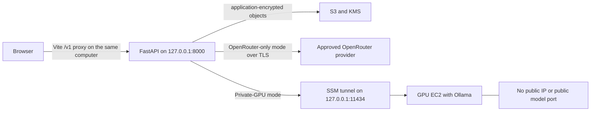

# Architecture

## Purpose

Private Chat is a personal, loopback-only chat application that can use either a privacy-restricted hosted model or a privately networked GPU inference host. Conversation storage, encryption and context assembly remain independent of the selected model backend.

## Runtime topology

The current personal deployment has no public application entry point. A future
public deployment would add authentication and authorisation at a separate edge
before exposing FastAPI; it must not expose the GPU or model port directly.

## Application boundaries

The backend follows a ports-and-adapters structure:

- **Domain:** durable concepts and rules such as conversations, messages and memory provenance.
- **Application:** use cases that authorise, assemble context, invoke a model and persist the encrypted result.
- **Ports:** typed `Protocol` interfaces required by the application.
- **Adapters:** OpenRouter, self-hosted inference, S3, KMS and EC2 implementations.
- **API:** FastAPI routes and Pydantic transport models.
- **Composition root:** the only place concrete adapters are selected and wired together.

Pydantic validates untrusted HTTP data and configuration. Domain and application code should not depend on FastAPI, boto3 or a particular model SDK.

## Important workflows

### Send a message

1. Validate the request at the API boundary.
3. Load and decrypt only the context needed for this request.
4. Build context from system instructions, rolling summary, sourced memories, recent messages and the current message.
5. Invoke the configured `ModelClient`.
6. Encrypt and persist the completed exchange.
7. Return a response without logging its body.

### Resume a conversation

The encrypted full transcript is authoritative. Rolling summaries and memories are derived data. Memories carry source message identifiers, timestamps and a confirmation state so generated inferences are not silently treated as facts.

### Start a GPU backend

The local session helper starts the Terraform-managed EC2 instance, waits for
Systems Manager readiness, then opens a loopback tunnel to Ollama. FastAPI does
not receive AWS control credentials and does not start the host on a browser
request. The GPU host is replaceable compute; encrypted conversation storage
does not depend on its lifecycle.

## Quality strategy

- Unit tests cover domain and application behaviour without AWS or network access.
- Contract tests ensure every model adapter obeys the same interface and error semantics.
- Integration tests cover encryption envelopes and infrastructure boundaries.
- Privacy regression tests assert that required routing controls cannot be omitted.
- Frontend tests cover the primary conversation workflow and accessibility-critical controls.
- Terraform checks cover formatting, validation and policy-sensitive defaults.
